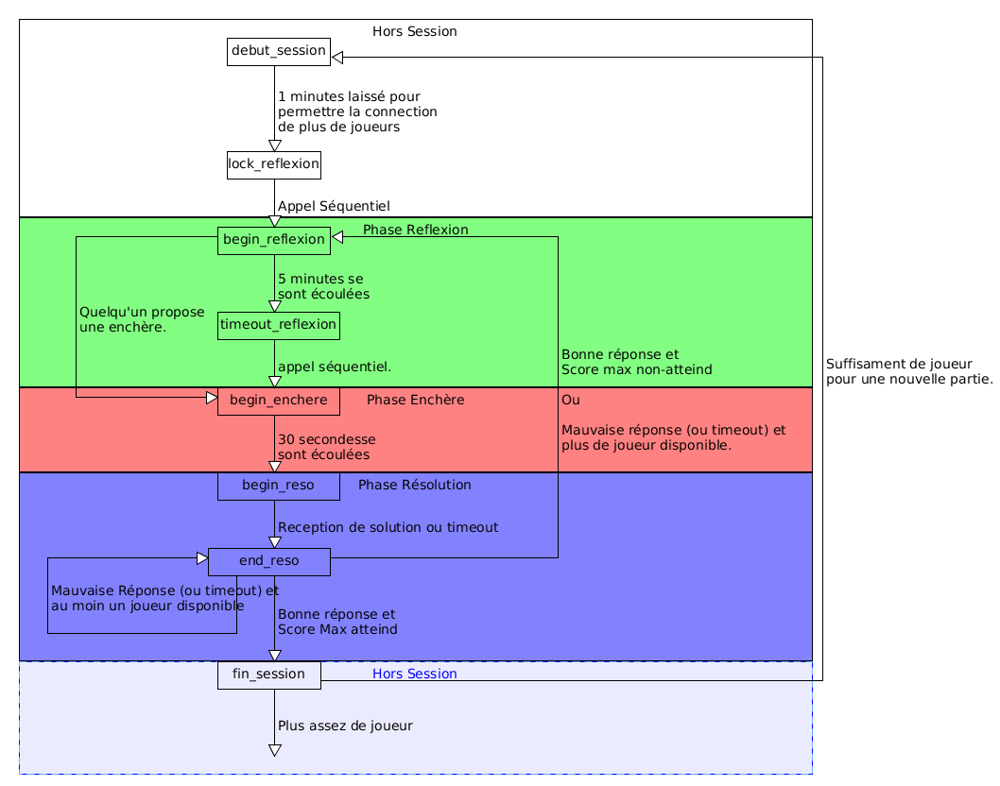

% Projet PC2R 2016
% Clément Bertrand, Jordi Bertran de Balanda

# Client

Le client est intégralement codé en C++. Les threads et l'affichage graphique sont gérés par QT 4.8. Ceci requiert l'installation des librairies QT4.

Installation rapide: `$ sudo apt-get install libqt4-dev`. 

## Compilation et lancement
```sh
$ qmake && make && ./client
```

Il se peut occasionnellement que le lien vers les librairies openGL soient mal configurés, auquel cas il faut les installer et les lier.

Si `$ locate libGL` renvoie un résultat pointant sur `path/libGL.so.x`:

```sh
ln -s path/libGL.so.x /usr/lib/libGL.so
```


## Classes

* __Client__ : gestion de la connexion au serveur - handshake de début, envoi/réception, terminaison.
* __Repr__: gestion de la représentation du plateau de jeu.
* __qSessionThread__: gestion du jeu une fois le client connecté, avec les différentes phases et les écoutes des messages qui concernent le client dans chaque phase. La boucle d'interaction est lancée dans un QThread séparé, et toute communication QThread-GUI est gérée par le biais de slots et signaux.
* __GUI__: affichage du jeu. Contient un plateauWidget et 4 Robot (classes uniqement d'affichage) et une Repr pour le suivi des positions des robots dans la GUI.

## Structures

* __Coldir__: association couleur/direction
* __Coords__: points 2D.
* __s\_move__: association couleur, direction et coordonnées d'origine, pour suivre les mouvements des robots et éventuellement en annuler certains.

## Énumérations

* __Incoming__: la liste des commandes que le client peut recevoir du serveur. Toutes traitées dans session.
* __Status__: OK ou KO, pour ne pas avoir à utiliser des booléens ou des ints.
* __Phase__: les 4 phases possibles dans la boucle de jeu du client.

## Outils

* Chaque fichier hormis tools est équipé d'un switch de debug - il suffit de `#define` le nom présent à l'en-tête du .cpp pour avoir des messages de debug sur la plupart des fonctions clés du fichier en question.
* Helpers pour la conversion string -> enum pour couleur et direction
* Helpers pour le parsing des messages serveur - fonction split selon un caractère, fonction de récupération des arguments et de la commande étant donné le message entier reçu par le client en string

## Exécution du client

__Note__: les commandes envoyées par le client sont basées sur la première version du sujet, donc avec deux commandes "SOLUTION", une pour la phase de réflexion et une pour la phase de résolution. Pour le rendre compatible avec les sujets basés sur la version mise à jour du sujet, il suffit de retirer `#define VERSION 1` dans le fichier gui.h.

### Au lancement

Le client attend la saisie d'un pseudo par l'utilisateur pour démarrer les échanges avec le serveur. Une fois le pseudo saise, le handshake initial CONNEXION/BIENVENUE est réalisé, et on substitue au QWidget de saisie du pseudo le QWidget contenant le plateau de jeu, les fenêtres de chat et la console, ainsi que les boutons de contrôle.

### En cours de partie

Chaque réception de commande par le client dans le QThread est divisée en sa commande et ses arguments. La commande aiguille le flux de la boucle d'interaction vers le signal à envoyer à la partie GUI, auquel on fournit systématiquement les arguments, qui sont traités dans le thread principal. Une commande inconnue est affichée sur la fenêtre console du client.

L'utilisateur peut à tout moment cliquer sur les boutons (pourvu qu'ils soient actifs) et envoyer des commandes au serveur. Dans le cas du bouton d'enchère, on préfère le désactiver sauf en phase d'enchères pour ne pas surcharger l'interface. Dans le cas du bouton de validation, on vérifie également la validité de la solution côté client, et on n'envoie la solution au serveur que si le client trouve celle-ci valide.

# Serveur

Le serveur est intégralement codé en OCAML.

Il est séparé en deux module principaux:

* Le module Server qui gère les connexion et la gestion des sessions de jeux. 
* Et le module GameState qui s'occupe de la génération et simulation du terrain de jeux; et les tests des solutions des joueurs.

## Module Server

Le module serveur à pour rôle de gérer la connexion des clients et de les synchroniser avec la session de jeu en cour. Il utilise n+1 Threads pour fonctionner, où n est le nombre de clients connecté. Le Thread supplémentaire sert à la connexion de nouveaux clients en attendant continuellement sur le ServerSocket et en créant un nouveaux Thread Client lorsque quelqu'un souhait ce connecter au serveur.

### Ressources

Le serveur nécessite certaine ressource relative aux client ou à la sessions de jeu actuel pour fonctionner. Il utilise le type joueur qui permet de stocker toute les informations relative au joueurs qui est connecté: 

```ocaml
type joueur = {
    nom: string;
    id : int;
    socket: Unix.file_descr;
    mutable score: int;
    inchan: in_channel;
    outchan: out_channel;
    mutable playing :bool
  }
```

* Nom: Pseudo du joueur. Nom transmis aux autres joueurs pour l'identifier.
* Id: numéro de référence unique attribué au joueur. Il est généré à l'aide du compteur `cpt_id`.
* Socket/inchan/outchan: La socket et les flux d'entrée et de sortie utilisé afin de communiqué avec le client.
* Score: Le score de ce joueur dans la session actuel.
* Playing: Variable booléenne indiquant si ce joueur participe au tour courant. Elle est initialisé à faux si le joueur se connecte alors qu'un tours de jeux est déjà commencé. Mais deviens vrai lorsque le prochain tours débute.

Le serveurs maintient une liste de joueur: `joueur_liste`, ainsi que le nombre de joueur actuellement connecté au serveur: nbJoueur. L'accès à ces deux variables est protégé par le mutex: `mutex_joueurL` afin d'éviter qu'elles ne deviennent corrompus par un accès simultanés de plusieurs Thread. 

Le serveur utilise aussi un certains nombre de ressource pour gérer la sessions de jeux: `phase` qui indique le numéro de phase du tour courant (0: hors d'un tour, 1: phase de réfléxion, 2: phase d'enchère, 3: phase de résolution); `tourNum` qui indique le numéro du tour courant; `scoreMax` qui est le score cible à atteindre pour gagner la partie; `liste_enchere` la liste des enchères des joueurs participants au tour courant. Ces ressources sont elles aussi protégées par un mutex: `mutex_phase`.

Les enchères de `liste_enchere` sont du type: 

```ocaml
type enchere = {
    id: int;
	username : string;
	cout : int;
    outchan : out_channel
}
```

* Id: L'identifiant unique du possesseur de l'enchère.
* Username: Le pseudo du possesseur de l'enchère.
* Cout: Valeur enchérie par le joueur.
* outchan: le flux de sortis qui permet d'envoyer des requêtes au joueur.

Au début d'un tour de jeu, `liste_enchere`  est initialisé avec une enchère négative pour chaque joueur participant. Lorsque les joueurs vont commencer à enchérirent, `liste_enchere` sera maintenue triée dans l'ordre de l'enchère la plus basse jusqu'à l'enchère la plus élevée, et à la fin les joueurs qui n'ont pas enchéri.

### Gestion de la session

Pour gérer le début et la fin des différentes phase des sessions, nous avons crée des fonctions  qui sont appelé au début et à la fin de chaque phase afin de mettre à jours les ressources (`phase`, `liste_enchere` et `tourNum`, `énigme`, `terrain`) et lancer les différents timers qui limitent le temps alloué à chaque phases. Elles vont aussi envoyer des messages aux clients afin de les prévenirs des changement de phases. 

Les timer sont les timer d'Unix qui lancent un signal SIGALRM à la fin du temps indiqué. Ainsi à chaque fois que nous démarrons un nouveau timer nous initialisons le handler de SIGALRM avec la fonction correspondant au timeout de cette phase.

Sur le graphe suivant vous pourrez observer les différents appels des fonctions qui gèrent les phases. Cependant il n'affiche pas le fait que lors d'une déconnexion, si le nombre de joueur deviens inférieur à 2, alors on termine la phase courante en appelant `fin_session`.



### Envoi des requêtes aux clients

Le serveur dispose d'une vingtaine de fonctions lui permettant de générer automatiquement les string des requêtes à envoyer aux clients. La majoritées de ces fonctions sont juste des concaténations de string mais quelques une d'entre elles font appelle au module gameState afin de générer les string correspondant à l'état des robots, ou la liste des murs.

Tous les envois de requêtes sont effectué avec la fonction output_string suivis d'un flush sur l'output. Nous envoyons aussi des requêtes d'erreur aux clients lorsque leurs requêtes ne respectent pas le bon format où qu'il n'ont pas le droit d'envoyer certains type de requêtes à cette phase du jeu.

### Traitement des requêtes client

Le serveur dispose d'une fonction de traitement pour chacune des requêtes que peut envoyer un client.

* __connexion__: Nous n’acceptons cette requête qu'au moment où une socket se connecte au serveur. A sa réception le serveur crée et ajoute un joueur à `joueur_liste` et il prévient chaque personne connectée de l'arrivée du nouveau participant. Si le nombre de joueur devient suffisant alors le serveur initialise une nouvel session et lance un timer d'une minute pour permettre la connexion de joueurs supplémentaires (`debut_session`).
* __sort__: Cette requête indique la sortie d'un joueur du serveur. Le serveur la traite en supprimant ce joueur de la liste des joueurs et des membres du tour courant. Ensuite Il ferme la socket du joueur et indique, à toutes les personnes connectées, son départ. Et pour finir, il vérifie qu'il reste plus d'un joueur sinon il termine la session (fin_session). Le même traitement est effectué si le joueur ferme sa socket sans avoir envoyer la requête.
* __solution (Réflexion)__: Cette requête n'es acceptée que lors de la phase de réflexion, si elle est envoyé par l'un des joueurs qui participe au tours. On l'a différencie de celle de la phase de résolution en vérifiant que son troisième élément est bien un entier positif.Le serveur la traite en mettant fin à la phase de réflexion et en modifiant l’enchère du joueur qui l'a lancé par la valeur indiquée dedans. Et indique à tout les joueurs participants au tours la fin de le phase de réflexion.
* __enchere__: Cette requête n'est acceptée que lors de la phase d'enchère, et si elle est envoyé par l'un des joueurs qui participe tours. Sont traitement est de mettre à jour l’enchère, du joueur qui l'a envoyé, dans liste_enchere. Lors de cette mise-à-jour, on vérifie qu'aucun autre joueur n'a fais une enchère de même valeur, et que cette enchère n'est pas plus élevées que celles que le joueur a éventuellement faite avant. Ensuite on annonce à tout les joueurs la présence de cette nouvelle enchère, si elle a été acceptée.
* __solution (Résolution)__: Cette requête n'est acceptée que lors de la phase de résolution, si elle est envoyé par le joueur actif (joueur dont l'enchère est au début de `liste_enchere`). Avant sont traitement nous vérifions par pattern_matching que le déplacement à le bon format, sinon la requête est rejetée. Ensuite pour la traiter nous convertissons le déplacement dans un format que peut comprendre GameState et nous lui demandons de vérifier si le déplacement permet de résoudre l'énigme. Si GameState refuse le déplacement où qu'il est plus long que l'enchère proposé par le joueur, il est alors exclus du tour et un autre joueur devient actif à sa place (`end_reso`). Si elle est correcte alors le tour se termine, on incrément le score du joueur actif. Si il n'a pas atteind le score max un autre tour débute (begin_reflexion), sinon on termine la session (`fin_session`).
* __message__: Cette requête peut être reçue à tout moment par une personne connectée. Son traitement est de renvoyer la même requête à toutes les autres personnes connectées.

### Les différents threads

* __Le Thread de connexion__: Ce thread est en attente de la connexion d'une nouvelle socket quasiment tout le temps. Lorsqu'une nouvelle socket se connecte, le thread crée un nouveau thread Client qui va traiter cette socket.
* __Le Thread Client__: A son démarrage il attend la requête de connexion. Si il reçoit une requête autre que celle si il se termine. Une fois la requête de connexion reçus, il se met en attente des autres requêtes. Une fois une requêtes reçus il exécute la fonction de traitement correspondante.
